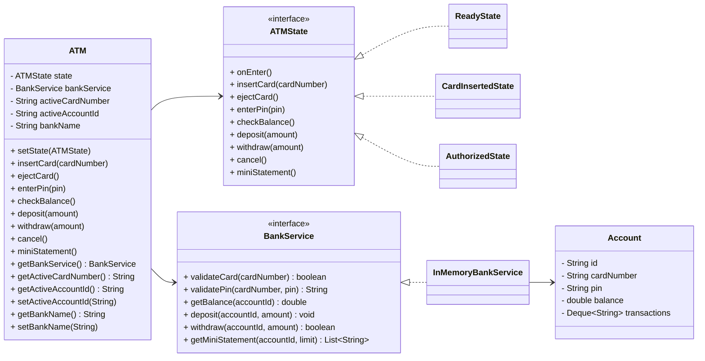

ATM System - State Pattern Redesign (Java)

Overview
This project implements an ATM using the State Design Pattern to eliminate complex conditional logic and model the machine as a clear state machine. The design adheres to SOLID principles and preserves typical ATM functionality.

How it works
- The `ATM` acts as the context. It holds the current `ATMState` and delegates user actions to it.
- Each state class encapsulates behavior for a specific phase: `ReadyState`, `CardInsertedState`, `AcceptingPinState`, and `AuthorizedState`.
- Transitions are done by states via `atm.setState(nextState)`; the context never uses nested conditionals to switch behavior.
- A `BankService` interface abstracts account operations; an `InMemoryBankService` provides a simple implementation for demo/testing.

What’s included (current version)
- Interactive console flow for selecting bank, inserting card, entering PIN
- Operation menu: Balance, Deposit, Withdraw, Mini Statement, Eject/Cancel
- Mini Statement support with simple transaction logging (in memory)
- Hardcoded test card for quick demo: card `CARD-1234`, PIN `4321`

Build and Run (no external build tool required)
1) Compile
```bash
javac -d out src/**/*.java
```

2) Run demo
```bash
java -cp out App
```

Windows PowerShell compile/run
```powershell
Remove-Item -Recurse -Force .\out -ErrorAction SilentlyContinue
New-Item -ItemType Directory -Force -Path .\out | Out-Null
$srcs = Get-ChildItem -Recurse -File -Path .\src -Filter *.java | ForEach-Object FullName
javac -d .\out @($srcs)
java -cp .\out App
```

Interactive Console Usage
- Start the app and follow prompts:
```
Select Bank:
1) DemoBank
2) OtherBank (same demo backend)
Enter choice:

Welcome to <Bank> ATM
Using test card: CARD-1234
Using test PIN: 4321

Select Operation:
1) Balance
2) Deposit
3) Withdraw
4) Mini Statement
5) Eject Card
6) Cancel/Exit
```
For demo, a seeded card exists: card `CARD-1234`, PIN `4321` with initial balance `100.0`.

UML Class Diagram


Key SOLID Principles Applied
- Single Responsibility: Each state handles only the behavior relevant to that specific state.
- Open/Closed: New states/behaviors can be added without modifying existing states; extend by creating new classes.
- Liskov Substitution: Any `ATMState` can replace another as they share the same interface.
- Interface Segregation: The public API of the ATM is stable; the domain is abstracted via `BankService`.
- Dependency Inversion: `ATM` depends on the `BankService` abstraction, not a concrete implementation.

State Pattern Summary
- Intent: Let the ATM alter its behavior when its internal state changes.
- Implementation: `ATM` delegates requests to a `ATMState` object that represents the current state. States decide transitions.

Demo scenario
The `App` class demonstrates a typical session: insert card → enter pin → check balance → withdraw → eject.


